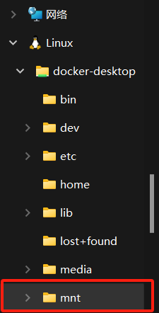
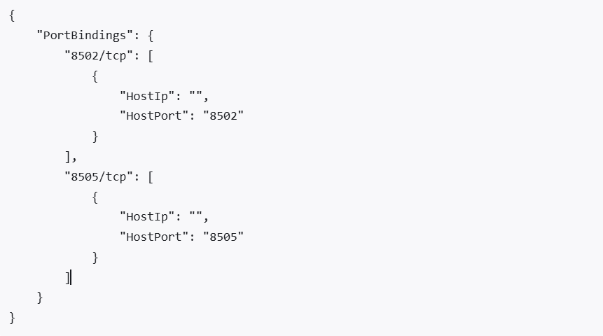
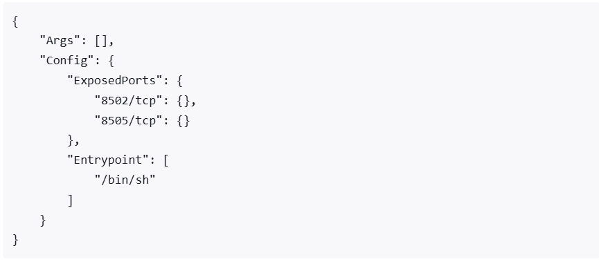

## docker-desktop找到对应的容器存储位置并修改端口等配置

##### 	执行步骤如下

1、`docker sotp 容器名称或id`
2、`docker inspect 容器名称或id | grep Id`来查找Id

3、直接到wsl文件资源管理器找到该目录直接通过id搜索



4、找到对应目录后修改`hostconfig.json中`的`"PortBindings":{}`格式如下



5、修改`config.v2.json`中的`"ExposedPorts": {}`和`"Ports":{}`格式如下



```json
"Ports":{
    "80/tcp":null,
    "8088/tcp":null,
    "8089/tcp":[{
        "HostIp":"0.0.0.0",
        "HostPort":"32771"
    }]
}
```


##### docker修改容器时区

> docker exec -it [容器ID] /bin/bash
>
> ln -sf /usr/share/zoneinfo/Asia/Shanghai /etc/localtime
> echo "Asia/Shanghai" > /etc/timezone
>
> docker restart [容器ID]
