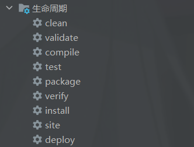

# 后端部署服务器

##### 		先执行生命周期中的clean，再执行install。完成后可以在target目录中找到jar包。

​									

##### 		将jar包压缩上传到服务器中，需要创建Dokcerfile文件并配置如下内容

```
FROM ip:port/xxx/openeuler-openjdk:1.0.0 as builder
ARG JAR_FILE=*.jar
COPY ${JAR_FILE} application.jar
RUN java -Djarmode=layertools -jar application.jar extract

FROM ip:port/xxx/openeuler-openjdk:1.0.0
COPY --from=builder dependencies/ ./
RUN true
COPY --from=builder snapshot-dependencies/ ./
RUN true
COPY --from=builder spring-boot-loader/ ./
RUN true
COPY --from=builder application/ ./
ENV TZ=Asia/Shanghai JAVA_OPTS="-Xms128m -Xmx256m"
ENTRYPOINT ["sh", "-c", "java $JAVA_OPTS org.springframework.boot.loader.JarLauncher"]
```

##### 		还需编写运行脚本start.sh，配置如下内容（以后上传时需要修改名称）

```
docker build -t docker.eewps.com/earthquake-warning-js/degal-upms-biz:0.2.2 .
docker push docker.eewps.com/earthquake-warning-js/degal-upms-biz:0.2.2
```

##### 		随后仅需要将上传的压缩包解压，使用`sh start.sh`命令运行脚本即可。

##### 		最后仅需要在rancher上找到指定的模块进行升级即可（需要修改名称，方便回滚）


==xml文件不要使用${id}做占位符，id可能被其他占用导致传入参数异常==
